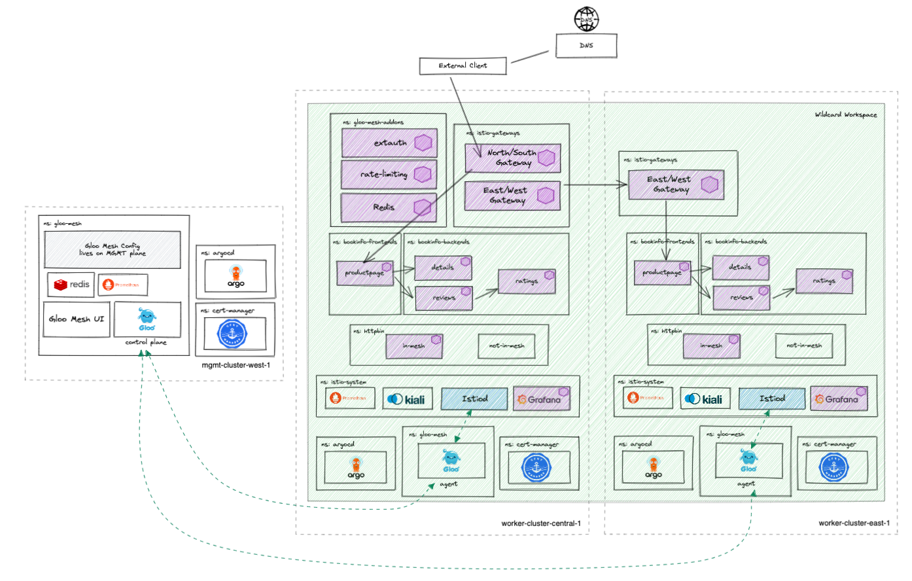
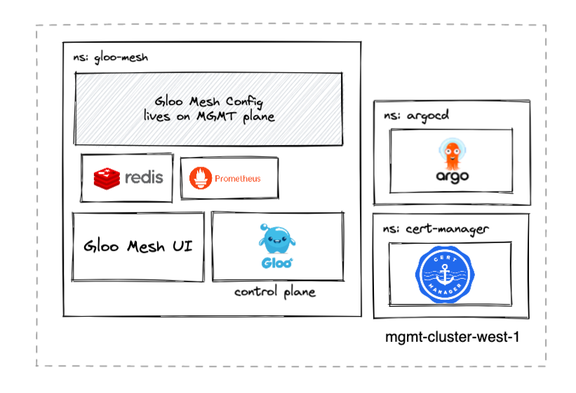

# gloo-mesh-demo-aoa

## version 2.1.0-beta23
This repo provides a multitenant capable GitOps workflow structure that can be forked and used to demonstrate the deployment and configuration of a multi-cluster mesh demo as code using the Argo CD app-of-apps pattern.

This repo is meant to be deployed along with the following repos to create the entire High Level Architecture diagram below.
- https://github.com/ably77/aoa-cluster1
- https://github.com/ably77/aoa-cluster2

# Prerequisites 
- 1 Kubernetes Cluster
    - This demo has been tested on 1x `n2-standard-4` (gke), `m5.xlarge` (aws), or `Standard_DS3_v2` (azure) instance for `mgmt` cluster

# High Level Architecture


# What this repo deploys


# Getting Started
Run:
```
./deploy.sh $LICENSE_KEY $cluster_context        # deploys on mgmt cluster by default if no input
```
The script will prompt you for a Gloo Mesh Enterprise license key if not provided as an input parameter

Note:
- By default, the script expects to deploy into a cluster context named `mgmt`
- Context parameters can be changed from defaults by changing the variables in the `deploy.sh` script. A check is done to ensure that the defined contexts exist before proceeding with the installation. Note that the character `_` is an invalid value if you are replacing default contexts
- Although you may change the contexts where apps are deployed as describe above, the Gloo Mesh and Istio cluster names will remain stable references (i.e. `mgmt`, `cluster1`, and `cluster2`)

# App of Apps Explained
The app-of-apps pattern uses a generic Argo Application to sync all manifests in a particular Git directory, rather than directly point to a Kustomize, YAML, or Helm configuration. Anything pushed into the `environment/<overlay>/active` directory is deployed by it's corresponding app-of-app
```
environment
├── wave-1
│   ├── active
│   │   ├── cert-manager-cacerts.yaml
│   │   ├── cert-manager-ns.yaml
│   │   ├── gloo-mesh-ns.yaml
│   │   ├── relay-identity-token-secret.yaml
│   │   └── relay-root-ca.yaml
│   ├── init.sh
│   ├── test.sh
│   └── wave-1-aoa.yaml
├── wave-2
│   ├── active
│   │   └── cert-manager.yaml
│   ├── init.sh
│   ├── test.sh
│   └── wave-2-aoa.yaml
├── wave-3
│   ├── active
│   │   ├── agent-cert.yaml
│   │   ├── clusterissuer.yaml
│   │   ├── gloo-mesh-cert.yaml
│   │   ├── gloo-mesh-ee-helm-disableca.yaml
│   │   ├── issuer.yaml
│   │   └── relay-tls-signing-cert.yaml
│   ├── init.sh
│   ├── test.sh
│   └── wave-3-aoa.yaml
└── wave-4
    ├── active
    │   ├── catchall-workspace.yaml
    │   ├── catchall-workspacesettings.yaml
    │   ├── gloo-mesh-cluster1-kubernetescluster.yaml
    │   ├── gloo-mesh-cluster1-virtualgateway-443.yaml
    │   ├── gloo-mesh-cluster1-virtualgateway-80.yaml
    │   ├── gloo-mesh-cluster2-kubernetescluster.yaml
    │   ├── gloo-mesh-global-workspacesettings.yaml
    │   ├── httpbin-rt-443-vd.yaml
    │   ├── httpbin-rt-80.yaml
    │   └── httpbin-virtualdestination.yaml
    ├── init.sh
    ├── test.sh
    └── wave-4-aoa.yaml
```

# forking this repo
Fork this repo and run the script below to your GitHub username if owning the control over pushing/pulling into the repo is desirable
```
cd tools/
./replace-github-username.sh <github_username>
```
Now you can push new manifests into the corresponding `environments` directories in your fork to sync them using Argo CD
