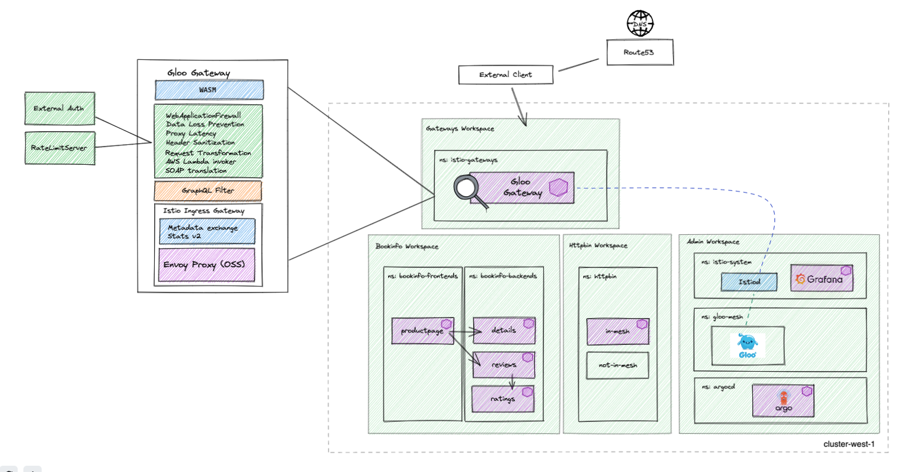

# gloo-mesh-demo-aoa

## version 2.0.9
This repo provides a multitenant capable GitOps workflow structure that can be forked and used to demonstrate the deployment and configuration of a single or multi-cluster mesh demo as code using the Argo CD app-of-apps pattern. To get started you just need 1 cluster, you can find the multi-cluster setup if you switch branches

# Prerequisites 
- 1 Kubernetes Cluster
    - This demo has been tested on 1x `n2-standard-4` (gke), `m5.xlarge` (aws), or `Standard_DS3_v2` (azure) instance for `mgmt` cluster

# High Level Architecture


# Getting Started
Run:
```
./deploy.sh           # deploys on mgmt cluster
```

Note:
- A temporary (5 day currently) license key is used here for demonstration purposes
- By default, the script expects to deploy into a cluster context named `mgmt`
- Context parameters can be changed from defaults by changing the variables in the `deploy.sh` script. A check is done to ensure that the defined contexts exist before proceeding with the installation. Note that the character `_` is an invalid value if you are replacing default contexts
- Although you may change the contexts where apps are deployed as describe above, the Gloo Mesh and Istio cluster names will remain stable references (i.e. `mgmt`)

# App of Apps Explained
Platform owners control the deployment of applications into the cluster with the app-of-apps pattern. The app-of-apps pattern uses a generic Argo Application to sync all manifests in a particular Git directory, rather than directly point to a Kustomize, YAML, or Helm configuration.

By using the app-of-app pattern, a Platform Administrator can provide some self-service capabilities to end users by delivering a synced directory in Git (i.e. infra team controls `infra` repo/directory, app team to `app` repo/directory) while still controlling what is ultimately deployed to the cluster and exposed through standard Kubernetes RBAC and Policy. This way, with the right policy in place, Applications are not deployed unless successfully committed Git and pushed to the correctly scoped team repo/directory
```
platform-owners
└── mgmt
    ├── mgmt-apps.yaml                      # syncs all apps pushed to environments/mgmt/apps/
    ├── mgmt-cluster-config.yaml            # syncs all apps pushed to environments/mgmt/cluster-config/
    ├── mgmt-infra.yaml                     # syncs all apps pushed to environments/mgmt/infra/
    └── mgmt-mesh-config.yaml               # syncs all apps pushed to environments/mgmt/mesh-config/
```

# forking this repo
Fork this repo and run the script below to your GitHub username if owning the control over pushing/pulling into the repo is desirable
```
cd tools/
./replace-github-username.sh <github_username>
```
Now you can push new manifests into the corresponding `environments` directories in your fork to sync them using Argo CD
